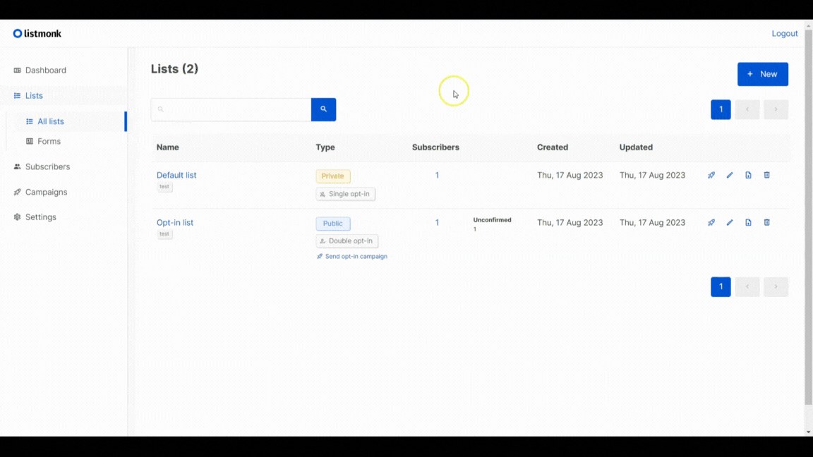

# Listmonk Basics

Listmonk is a self-hosted platform designed for newsletter and mailing list management. It's an ideal solution for individuals looking to curate a subscriber list and efficiently send out email campaigns.

_[Watch the video tutorial](https://www.youtube.com/watch?v=Myq8MqT9xfM) for a visual demonstration._

Explore the [official Listmonk documentation](https://listmonk.app/docs/) for detailed information.

## Setting Up Listmonk

Listmonk provides a self-hosted solution for managing email lists and campaigns. Follow these steps to set up your Listmonk environment:

1. Install Listmonk on your server.
2. Configure the necessary settings, such as database connections and SMTP configurations.
3. Access the Listmonk admin interface.

## Creating Your First Campaign

When you're ready to reach out to your subscribers via email, it's time to kick off a campaign. This step includes fine-tuning the essential email details to ensure effective communication.

Here are the steps:

1. On the left side menu, click on ‘**Campaigns**’
2. Click on ‘**+ Create new**’
3. Add the **name** and **subject line**.
4. **Change the ‘from’ email address** as needed.
5. **Select a ‘list’ of subscribers** from the dropdown menu. If you don't have any lists yet, create one first.
6. **Choose a template** from the dropdown menu.
7. Optionally, add **tags**.
8. Click **continue**.
9. Craft the **email content**, similar to composing a message.
10. Click ‘**preview**’ in the upper right to see how your email will look.
11. Click ‘**save changes**’ in the upper right.
12. Click ‘**start campaign**’ to send the campaign to your subscribers.

## Creating a New List

In your Listmonk account, you can maintain multiple subscriber lists, organizing them based on the campaigns you're running.

Here are the steps:

1. Click ‘**Lists**’ in the left side menu.
2. Choose ‘**all lists**’.
3. Click ‘**+ New**’ in the upper right corner.
4. Assign a **name** to your list.
5. Specify **private or public** status. Public lists are open for subscription and may appear on public pages.
6. Select **single opt-in or double opt-in**.
7. Optionally, add **tags** for categorization.
8. Optionally, provide a **description** for the list.
9. Click ‘**save**’.
