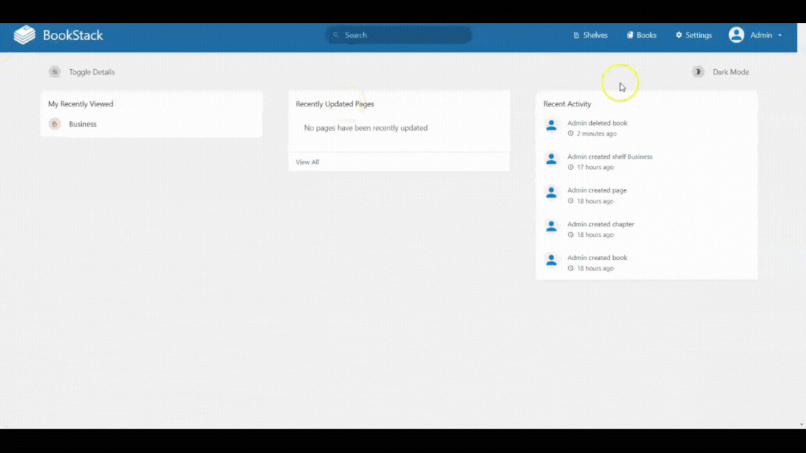
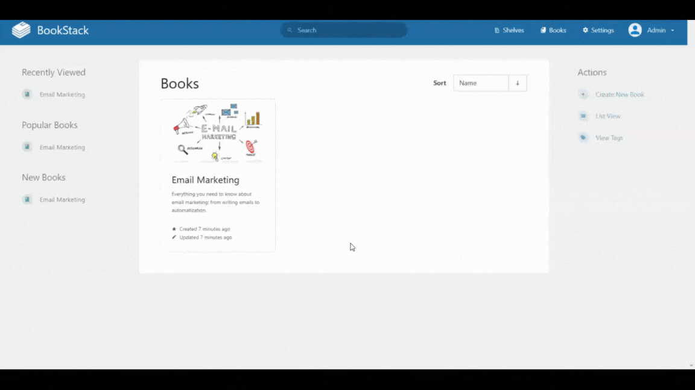

# Getting Started with BookStack App

**BookStack** is a user-friendly, self-hosted platform designed for efficient organization and storage of information. The platform's content is fully searchable, allowing you to search at various levels, from books to chapters and pages. Linking directly to specific paragraphs keeps your documentation connected. This tutorial will guide you through the process of creating books and shelves.

Watch the [YouTube video tutorial](https://www.youtube.com/watch?v=zrSB8moqRFs) for a visual demonstration.

Explore the [official BookStack documentation](https://bookstackapp.com/docs/) for comprehensive details.

## Creating a Book

Adding and editing books in BookStack is straightforward. You can include content, tables, images, and links. Here's how to create a book:

1. In the upper right corner, click on **books**.
2. Click **create a new book** under the actions on the right side of your screen.
3. Provide a **name and description** for the new book.
4. Add a **cover image** (size: 440x250 px) by clicking **select image**.
5. Optionally, include **tags** for improved categorization.
6. Click **save book**.

## Creating a Chapter

Books can contain multiple chapters, which can be added and edited as needed. Here's how to create a chapter:

1. Click on **new chapter** on the right side of your screen.
2. Write a **title and description** for the chapter.
3. Optionally, include **tags**.
4. Click **save chapter**.

## Creating a Page

Pages can belong to books or chapters and accommodate varying lengths of content. Here's how to create a page:

1. Click on **new page** on the right side of your screen.
2. Add a **page title** above the editing ribbon on your dashboard.
3. Compose your **content** using the editing tools on the ribbon.
4. Click **save page** at the top right above the editing ribbon.

## Creating a Shelf

Shelves help you organize and categorize your books or documents. They are useful for managing content by departments, categories, industries, or disciplines. Here's how to create a shelf:

1. Click on the **shelves** button in the upper menu.
2. Under **actions** on the right, click **new shelf**.
3. Provide a **name and description** for the shelf.
4. **Select** the books you want on this shelf by clicking the **plus** sign next to their names.
5. Optionally, add a **cover image** that represents the shelf.
6. Include **tags** for easy navigation (optional).
7. Click **save shelf** at the bottom of the screen.
